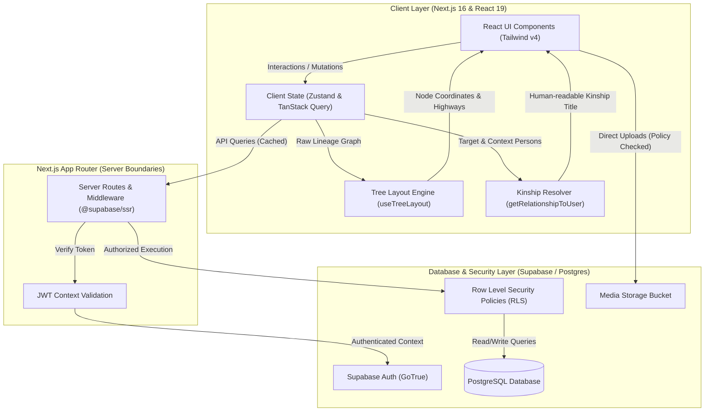

# 🌳 BongshoBrikkho (বংশবৃক্ষ)
### *Next-Generation Family Heritage, Relationship Graph & Social Platform*

[](https://nextjs.org/)
[](https://react.dev/)
[](https://www.typescriptlang.org/)
[](https://supabase.com/)
[](https://tailwindcss.com/)
[](./LICENSE)
[](https://github.com/mdsameersakib)

---

## 📌 Executive Summary & Engineering Highlights

**BongshoBrikkho** (*Bengali for "Family Tree"*) is a modern, high-performance web application designed to visually map multi-generational family structures, calculate complex cultural kinship relationships, and foster private social interaction across family networks.

Built from the ground up to solve the spatial and computational challenges of rendering multi-branch ancestral trees, the platform combines custom graph layout mathematics with server-less PostgreSQL security.

### 🌟 Key Engineering Accomplishments

- **Custom Multi-Layered Tree Auto-Layout Algorithm**: Built a custom deterministic layout engine (`useTreeLayout`) featuring **Binary Side Partitioning** (paternal vs. maternal split), **Centrifugal Island Force** (preventing sibling subtree overlaps), and dynamic **Orthogonal Highway Bus Routing** to eliminate crossing connectors across generations.
- **Cultural Kinship & Relationship Resolution Engine**: Implemented an automated graph-traversal relationship algorithm (`getRelationshipToUser`) capable of parsing direct, step, half, and extended multi-degree family ties (including culturally nuanced titles for Bengali and global lineages).
- **Zero-Trust Security & Row-Level Security (RLS)**: Enforced strict data boundaries across all tables (`persons`, `marriages`, `parent_child`, `posts`, `events`) using native PostgreSQL RLS policies tied directly to `auth.uid()` and explicit `network_connections` status.
- **Server Components & Client State Boundaries**: Optimized Next.js 16 App Router architecture using `@supabase/ssr` for server-side auth validation, paired with TanStack Query v5 and Zustand for client-side caching and state synchronization.
- **Granular Branch Privacy Controls**: Designed user-level privacy matrices (`privacy_settings`) and staging environments (`tree_merge_sessions`) to support partial tree sharing, connection requests, and sub-tree conflict resolution.

---

## 📐 System Architecture Diagram



---

## 🖼️ Platform Walkthrough & Screenshots

Below is an overview of the core application modules and their respective engineering features.

> **Note for Reviewers**: Place your platform screenshots inside `./public/screenshots/` following the file naming standard below to view live previews.

| Module & Preview Path | Feature Overview | Technical Highlights |
| :--- | :--- | :--- |
| **01. Landing & Onboarding**<br>`./public/screenshots/01-landing.png` | Public presentation page detailing platform security, family tree features, and user registration. | SSR rendered layout, theme hydration protection, and seamless OAuth/email auth entry points. |
| **02. Authentication**<br>`./public/screenshots/02-login.png` | Secure user authentication interface supporting account login and registration. | Managed via Supabase Auth with server-side cookie sessions handled via `@supabase/ssr` middleware. |
| **03. Main Dashboard**<br>`./public/screenshots/03-dashboard.png` | Central command center showing immediate family metrics, upcoming anniversaries, and quick-add actions. | Aggregates multi-table data using TanStack Query parallel fetching and reactive optimistic updates. |
| **04. Interactive Family Tree Canvas**<br>`./public/screenshots/04-family-tree.png` | Zoomable, pan-enabled interactive canvas rendering the family graph with custom node components. | Dynamic spatial grid computed via `useTreeLayout` with sub-pixel node placement and edge highway routing. |
| **05. Lineage & Family Directory**<br>`./public/screenshots/05-family-list.png` | Tabular and card-view directory of all accessible family members with search and filter capabilities. | Client-side fuzzy search, relationship title calculation on-the-fly, and owner-only editing controls. |
| **06. Family Social Wall**<br>`./public/screenshots/06-family-wall.png` | Private timeline for sharing family announcements, photos, comments, and reactions. | Integrated Supabase Storage with bucket-level security policies and real-time reactive mutations. |
| **07. Key Milestones & Events**<br>`./public/screenshots/07-events.png` | Dedicated calendar and feed for family birthdays, wedding anniversaries, and memorial dates. | Date calculations powered by `date-fns` with automatic milestone reminders relative to the current year. |
| **08. Account & Tree Settings**<br>`./public/screenshots/08-settings.png` | Profile management, network connection requests, and branch privacy configuration. | Row-Level Security policy enforcement ensuring users can only manage their own node visibility settings. |

---

## 🛠️ Technology Stack

| Domain | Technology | Engineering Purpose |
| :--- | :--- | :--- |
| **Frontend Framework** | [Next.js 16 (App Router)](https://nextjs.org/) | Server-Side Rendering (SSR), React Server Components, efficient routing & asset optimization |
| **UI Library** | [React 19](https://react.dev/) | Component architecture, concurrent rendering features, and high-performance UI states |
| **Language** | [TypeScript 5](https://www.typescriptlang.org/) | Strict end-to-end type safety across database entities, form schemas, and graph engines |
| **Database & Auth** | [Supabase (PostgreSQL)](https://supabase.com/) | Relational storage, GoTrue authentication, native Row-Level Security (RLS), and file storage |
| **Data Fetching & Cache**| [TanStack Query v5](https://tanstack.com/query) | Client-side query caching, deduplication, background revalidation, and optimistic mutations |
| **State Management** | [Zustand](https://zustand-demo.pmnd.rs/) | Lightweight global UI state management for viewport controls and selected node context |
| **Graph & Visuals** | [ReactFlow](https://reactflow.dev/) + Custom Canvas | Interactive panning, zooming, custom SVG connector rendering, and node positioning |
| **Form Handling** | [React Hook Form](https://react-hook-form.com/) + [Zod](https://zod.dev/) | Type-safe form validation, schema verification, and user input sanitization |
| **Styling** | [Tailwind CSS v4](https://tailwindcss.com/) | Modern utility-first CSS engine with CSS variables and responsive dark/light theme support |

---

## 🔒 Security & Database Design

### Row-Level Security (RLS) Paradigm

Security in **BongshoBrikkho** is enforced at the database query level rather than solely relying on backend application code:

- **Strict Data Ownership**: The `persons` table tracks an `owner_uid`. Owners retain full `ALL` access (create, update, delete) over their branch data.
- **Connection-Based Access Control**: Non-owned family nodes are only readable if a mutual row exists in `network_connections` with `status = 'accepted'`.
- **Relationship Integrity**: Junction tables (`parent_child` and `marriages`) enforce foreign keys and uniqueness constraints (`CHECK (person1_id < person2_id)`) to prevent cyclical duplication.
- **Server Secret Isolation**: Anonymous public keys (`NEXT_PUBLIC_SUPABASE_ANON_KEY`) are scoped strictly to client-side RLS queries, preventing unauthorized data access even if exposed.

---

## 💻 Local Development & Setup

### Prerequisites

- **Node.js**: `v18.0.0` or higher
- **Package Manager**: `pnpm` (v9 or higher recommended)
- **Database**: A [Supabase](https://supabase.com/) project (Free tier compatible)

### Step-by-Step Installation

1. **Clone the Repository**
   ```bash
   git clone https://github.com/mdsameersakib/BongshoBrikkho.git
   cd BongshoBrikkho
   ```

2. **Install Dependencies**
   ```bash
   pnpm install
   ```

3. **Configure Environment Variables**
   Copy the example environment file and populate it with your Supabase project credentials:
   ```bash
   cp .env.example .env.local
   ```
   Edit `.env.local`:
   ```env
   NEXT_PUBLIC_SUPABASE_URL=https://your-supabase-project-id.supabase.co
   NEXT_PUBLIC_SUPABASE_ANON_KEY=your-supabase-anon-key
   ```

4. **Initialize Database Schema**
   - Open your Supabase Dashboard SQL Editor.
   - Run the contents of [`supabase-schema.sql`](./supabase-schema.sql) to initialize tables, relationships, triggers, and Row Level Security policies.
   - Run any additional migrations in [`supabase/migrations/`](./supabase/migrations/) if required.

5. **Start the Development Server**
   ```bash
   pnpm dev
   ```
   Navigate to `http://localhost:3000` in your browser.

---

## 📄 License & Commercial Restriction

This project is licensed under the **PolyForm Noncommercial License 1.0.0**.

### 🚫 Non-Commercial & Anti-Resale Terms

- **Allowed Uses**: Personal inspection, code review by recruiters/senior engineers, portfolio demonstrations, and non-commercial educational study are fully permitted.
- **Prohibited Uses**: You **may not** sell, sublicense, re-package, host as a paid software-as-a-service (SaaS), or commercially exploit this source code, brand, or derived architecture in any form without explicit written consent from the author.

For complete terms, see the [`LICENSE`](./LICENSE) file.

---

<div align="center">

**Developed by [Md. Sameer Sakib](https://github.com/mdsameersakib)**  
*Engineered for family heritage preservation & technical excellence.*

</div>
